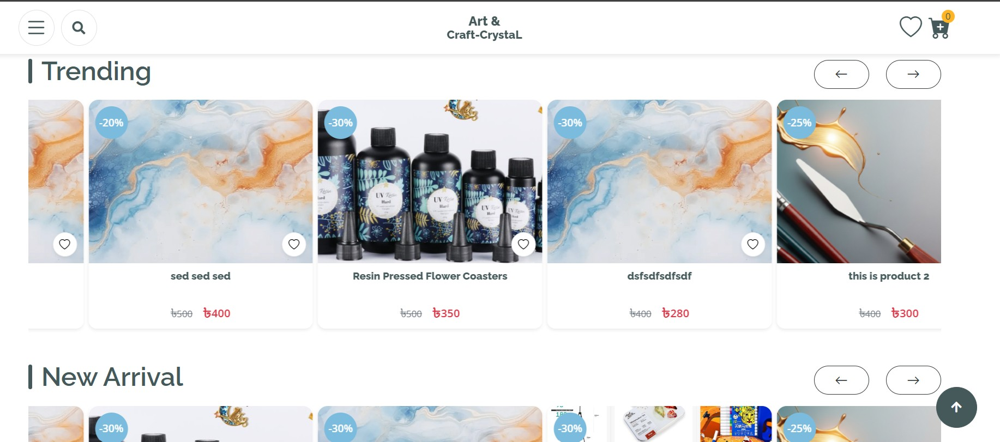
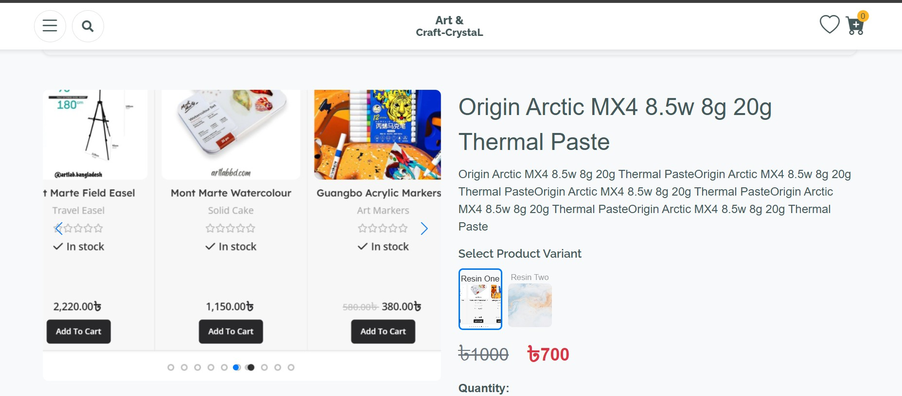
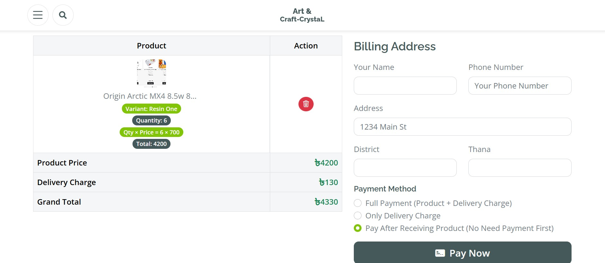
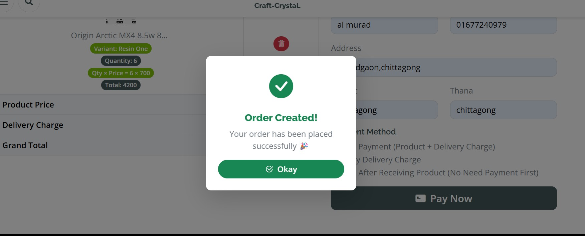
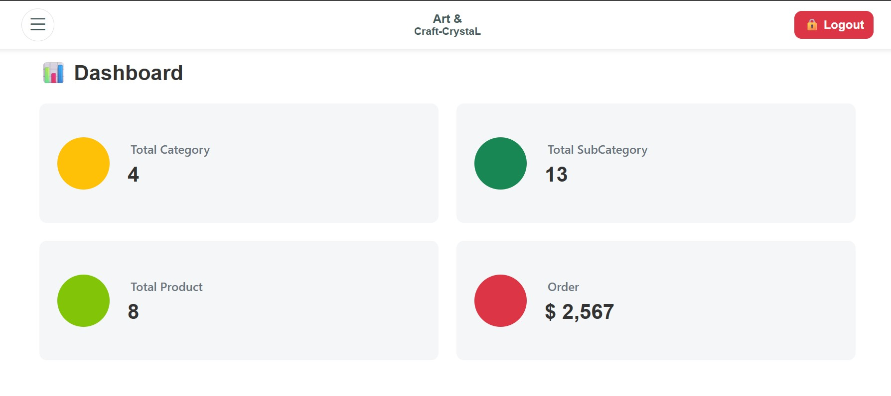
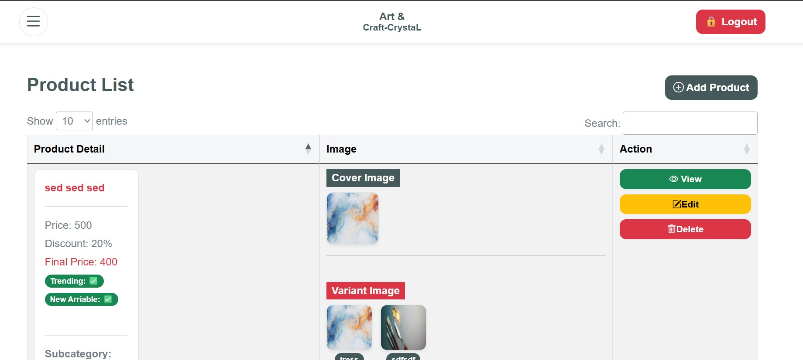
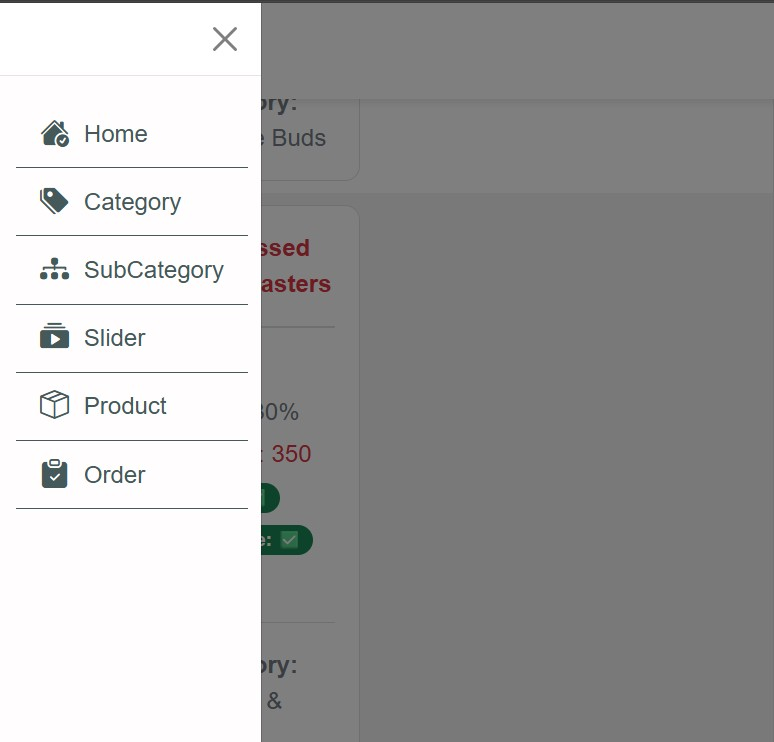

# 🛒 Django REST Framework + AJAX E-commerce Website

This is a **complete e-commerce website** built for a local client using:

- **Django REST Framework (DRF)** for backend APIs  
- **AJAX,JAVASCRIPT,BOOTSTRAP,HTML,CSS** for asynchronous requests  
- **Bootstrap** for responsive UI  

👉 The project is powered by **REST API + AJAX**, making it lightweight, fast, and dynamic.

 
 
 

 
  
    